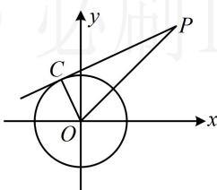

> [!faq]- 《第3节 圆的切线有关的计算》参考答案
>
> > [!success]- **【答案】** 4
>
> > [!note]- **【分析】**
> > 本题未单列分析。
>
> > [!note]- **【解析】**
> > 解析：如图， $|PO| = \sqrt{3^2 + 3^2} = 3\sqrt{2}$
> >
> > 所以切线长 $\left|PC\right|=\sqrt{\left|PO\right|^{2}-\left|OC\right|^{2}}=\sqrt{(3\sqrt{2})^{2}-2}=4$ .
> >
> > 
