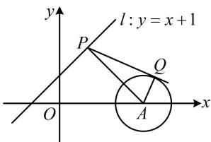

> [!faq]- 《第3节 圆的切线有关的计算》参考答案
>
> > [!success]- **【答案】** C
>
> > [!note]- **【分析】**
> > 本题未单列分析。
>
> > [!note]- **【解析】**
> > 解析：$x^{2} + y^{2} - 6x + 8 = 0\Rightarrow (x - 3)^{2} + y^{2} = 1$
> >
> > 所以圆心为 $A(3,0)$ ，半径 $r = 1$ ，如图，设 $P$ 为直线 $y = x + 1$ 上一点， $PQ$ 与 $\odot A$ 相切于点 $Q$ ，所求即为 $|PQ|$ 的最小值，这是圆的切线长，可考虑转化为圆外的点 $P$ 到圆心 $A$ 的距离来处理，
> >
> > 由图可知， $PQ \perp AQ$ ，且 $|AQ| = 1$ ，
> >
> > 所以 $\left|PQ\right|=\sqrt{\left|PA\right|^{2}-\left|AQ\right|^{2}}=\sqrt{\left|PA\right|^{2}-1}$ ①,
> >
> > 要使 $|PQ|$ 最小，只需 $|PA|$ 最小，显然当 $PA \perp l$ 时， $|PA|$ 最小， $y = x + 1$ 可化为 $x - y + 1 = 0$ ，所以 $\left|PA\right|_{\min} = \frac{\left|3 - 0 + 1\right|}{\sqrt{1^2 + (-1)^2}} = 2\sqrt{2}$ ，代入①得 $\left|PQ\right|_{\min} = \sqrt{(2\sqrt{2})^2 - 1} = \sqrt{7}$ .
> >
> > 
