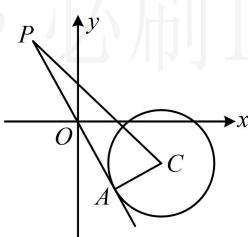

> [!faq]- 《第3节 圆的切线有关的计算》参考答案
>
> > [!success]- **【答案】** C
>
> > [!note]- **【分析】**
> > 本题未单列分析。
>
> > [!note]- **【解析】**
> > C
> > 解析：圆 C 关于直线 l 对称 $\Rightarrow$ 圆心 $C(2,-1)$ 在直线 l 上 $\Rightarrow 2a - 2b + 6 = 0 \Rightarrow b = a + 3$ ①，
> > 如图，可在 $\triangle PCA$ 中用勾股定理算切线长 $|PA|$ ，下面先算 $|PC|$ ， $|PC| = \sqrt{(a-2)^{2} + (b+1)^{2}}$ 所以 $\left|PA\right|=\sqrt{\left|PC\right|^{2}-\left|AC\right|^{2}}=\sqrt{(a-2)^{2}+(b+1)^{2}-2}$ 有 a, b 两个变量，可利用式①来消元，
> > 将式①代入可得 $\left|PA\right|=\sqrt{(a-2)^{2}+(a+3+1)^{2}-2}$ $=\sqrt{2a^{2}+4a+18}=\sqrt{2(a+1)^{2}+16}$ 故当 a=-1 时， $|PA|$ 取得最小值 4.
> >
> > 
