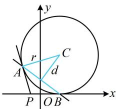

> [!faq]- 《第3节 圆的切线有关的计算》参考答案
>
> > [!success]- **【答案】** (★★☆) 若圆 $C:(x - 2)^{2} + (y - 4)^{2} = 16$ ，过点 $P(-1,0)$ 作圆 $C$ 的两条切线，切点分别为 $A$ ， $B$ ，则 $\vert AB\vert = \_$ .7. $\frac{24}{5}$
>
> > [!note]- **【分析】**
> > 本题未单列分析。
>
> > [!note]- **【解析】**
> > 解析：如图，可先由切点弦结论写出直线 $AB$ 的方程，切点弦 $AB$ 的方程为 $(-1 - 2)(x - 2) + (0 - 4)(y - 4) = 16$ 整理得： $3x + 4y - 6 = 0$ 此时 $\left|AB\right|$ 可看成直线 $AB$ 被圆 $C$ 截得的弦长，先算 $d$ 圆心 $C(2,4)$ 到直线 $AB$ 的距离 $d = \frac{\left|3\times 2 + 4\times 4 - 6\right|}{\sqrt{3^2 + 4^2}} = \frac{16}{5}$ 所以 $\left|AB\right| = 2\sqrt{r^2 - d^2} = 2\sqrt{16 - \left(\frac{16}{5}\right)^2} = \frac{24}{5}$ .
> >
> > 
