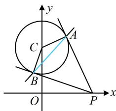

> [!faq]- 《第3节 圆的切线有关的计算》参考答案
>
> > [!success]- **【答案】** A
>
> > [!note]- **【分析】**
> > 本题未单列分析。
>
> > [!note]- **【解析】**
> > A
> >
> > 解析：如图，可由切点弦结论写出直线 $AB$ 的方程，因为 $P(x_0,0)$ ，所以直线 $AB$ 的方程为 $x_0x+$ $(0 - \sqrt{3})(y - \sqrt{3}) = 1$ ，整理得： $x_0x - \sqrt{3} y + 2 = 0$ 题干给出 $|AB|\geq \sqrt{3}$ ，于是得算 $|AB|$ ，可按直线 $AB$ 被圆截得的弦长来算，先求圆心到直线 $AB$ 的距离 $d$ 圆 $C$ 的圆心为 $C(0,\sqrt{3})$ ，半径 $r = 1$ ，故 $d = \frac{|-\sqrt{3}\times\sqrt{3} + 2|}{\sqrt{x_0^2 + (-\sqrt{3})^2}}$ $= \frac{1}{\sqrt{x_0^2 + 3}}$ ，所以 $|AB| = 2\sqrt{r^2 - d^2} = 2\sqrt{1 - \frac{1}{x_0^2 + 3}}$ 因为 $|AB|\geq \sqrt{3}$ ，所以 $2\sqrt{1 - \frac{1}{x_0^2 + 3}}\geq \sqrt{3}$ 结合 $x_0 > 0$ 可解得： $x_0\geq 1$ ，故 $x_0$ 的最小值为1.
> >
> > 
