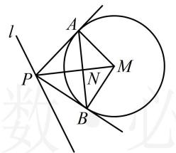
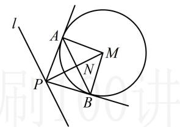

> [!faq]- 《第3节 圆的切线有关的计算》参考答案
>
> > [!success]- **【答案】** D
>
> > [!note]- **【分析】**
> > 本题未单列分析。
>
> > [!note]- **【解析】**
> > $$
> > x ^ {2} + y ^ {2} - 2 x - 2 y - 2 = 0 \Rightarrow (x - 1) ^ {2} + (y - 1) ^ {2} = 4
> > $$
> >
> > 所以圆 $M$ 的圆心为 $M(1,1)$ ，半径 $r = 2$ ，要求直线 $AB$ 的方程，只需求出点 $P$ 的坐标，代切点弦结论即可，注意到 $|AB|$ 与 $|PM|$ 有关系，所以为了分析 $|PM| \cdot |AB|$ 何时最小，先把 $|AB|$ 也用 $|PM|$ 表示，如图1，设 $AB$ 与 $PM$ 交于点 $N$ ，则 $AN \perp PM$ ，下面先求 $|AN|$ ，可在 $\triangle PAM$ 中用等面积法，
> >
> > 因为 $S_{\triangle PAM} = \frac{1}{2}\big|PA\big|\cdot |AM| = \frac{1}{2}\big|PM\big|\cdot |AN|$ ，所以 $\big|AN\big| =$
> >
> > $$
> > \frac {\left| P A \right| \cdot \left| A M \right|}{\left| P M \right|} = \frac {2 \left| P A \right|}{\left| P M \right|} = \frac {2 \sqrt {\left| P M \right| ^ {2} - 4}}{\left| P M \right|} = 2 \sqrt {1 - \frac {4}{\left| P M \right| ^ {2}}},
> > $$
> >
> > 从而 $|AB|=2|AN|=4\sqrt{1-\frac{4}{|PM|^{2}}}$ ，
> >
> > $$
> > \left| P M \right| \cdot \left| A B \right| = \left| P M \right| \cdot 4 \sqrt {1 - \frac {4}{\left| P M \right| ^ {2}}} = 4 \sqrt {\left| P M \right| ^ {2} - 4},
> > $$
> >
> > 所以当 $|PM|$ 最小时， $|PM|\cdot|AB|$ 也最小，
> >
> > 而 $|PM|$ 最小时应有 $PM \perp l$ ，如图2，
> >
> > 可由此垂直关系求得 $PM$ 的斜率，结合点 $M$ 写出其方程，并与 $l$ 联立求出 $P$ 的坐标，
> >
> > 因为直线 $l$ 的斜率为-2，所以 $PM$ 的斜率为 $\frac{1}{2}$ ，
> >
> > 故 $PM$ 的方程为 $y - 1 = \frac{1}{2} (x - 1)$ ，整理得： $x - 2y + 1 = 0$ ，
> >
> > 联立 $\left\{\begin{aligned}x-2y+1&=0\\ 2x+y&=0\end{aligned}\right.$ 解得： $\left\{\begin{aligned}x&=-1\\ y&=0\end{aligned}\right.$ ，所以 $P(-1,0)$ ，
> >
> > 由切点弦结论可知直线 $AB$ 的方程为 $-x + 0\cdot y - 2\cdot \frac{-1 + x}{2}$
> >
> > $-2\cdot\frac{0+y}{2}-2=0$ ，整理得： $2x+y+1=0$
> >
> >   
> > 图1
> >
> >   
> > 图2
