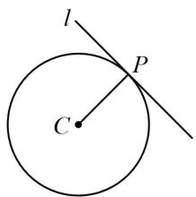
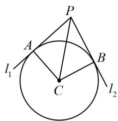
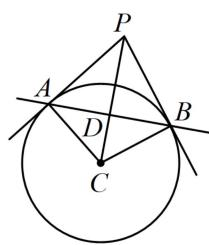
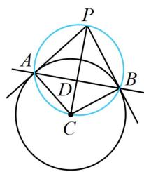

<!-- source-part:1 pages:1-7 -->

# 第 3 节 圆的切线有关的计算（★★☆）

## 内容提要

1. 求圆 $C: (x - a)^2 + (y - b)^2 = r^2$ 过点 $P(x_0, y_0)$ 的切线：

① 若点 $P$ 在圆上，如图1，可由 $PC \perp l$ 找到切线 $l$ 的斜率（斜率可能不存在，此时切线即为 $x = x_0$ ），结合点 $P$ 可求得切线方程.

②若点 $P$ 在圆外，如图2，可设切线斜率为 $k$ （需先考虑斜率不存在的情况），结合点 $P$ 写出切线的方程，并由圆心到直线的距离 $d = r$ 来解 $k$ .

2. 计算切线长：如图2，切线长 $|PA| = |PB| = \sqrt{|PC|^2 - r^2}$ .

3. 计算切点弦方程: 如图 3, 点 $P(x_0, y_0)$ 在圆 $C: (x - a)^2 + (y - b)^2 = r^2$ 外, $PA$ , $PB$ 是两条切线, $A$ , $B$ 是切点, 则 $PA \perp AC$ , $PB \perp BC$ , 所以 $P$ , $A$ , $C$ , $B$ 四点都在以 $PC$ 为直径的圆上 (如图 4), $AB$ 恰好为该圆与圆 $C$ 的公共弦, 故可由两圆的方程作差求得直线 $AB$ 的方程.

4. 切线和切点弦方程的结论：设点 $P(x_0, y_0)$ ，将圆的标准方程 $(x - a)^2 + (y - b)^2 = r^2$ 变成 $(x - a)(x_0 - a) + (y - b)(y_0 - b) = r^2$ ，或在圆的一般式方程 $x^2 + y^2 + Dx + Ey + F = 0$ 中，用 $x_0x$ 替换 $x^2$ ，用 $y_0y$ 替换 $y^2$ ，用 $\frac{x + x_0}{2}$ 替换 $x$ ，用 $\frac{y + y_0}{2}$ 替换 $y$ ，可以得到一个新方程，当 $P$ 在圆上时，如图1，该方程表示切线 $l$ ；当 $P$ 在圆外时，如图3，该方程表示切点弦 $AB$ 所在直线的方程。

5. 如图3，四边形 $PACB$ 的面积 $S = S_{\triangle PAC} + S_{\triangle PBC} = \frac{1}{2}\big|PC\big|\cdot \big|AD\big| + \frac{1}{2}\big|PC\big|\cdot \big|BD\big|$ $= \frac{1}{2}\big|PC\big|\cdot (\big|AD\big| + \big|BD\big|) = \frac{1}{2}\big|PC\big|\cdot \big|AB\big|$ .

  
图1

  
图2

  
图3

  
图4

![[高中/总复习/教辅/一数常规版2026/第10章 解析几何/模块2 圆与方程/第3节 圆的切线有关的计算/类型01_求圆的切线方程/类型01_求圆的切线方程.md]]
![[高中/总复习/教辅/一数常规版2026/第10章 解析几何/模块2 圆与方程/第3节 圆的切线有关的计算/类型02_切线长有关计算/类型02_切线长有关计算.md]]
![[高中/总复习/教辅/一数常规版2026/第10章 解析几何/模块2 圆与方程/第3节 圆的切线有关的计算/类型03_切点弦相关计算/类型03_切点弦相关计算.md]]
![[高中/总复习/教辅/一数常规版2026/第10章 解析几何/模块2 圆与方程/第3节 圆的切线有关的计算/强化训练/强化训练.md]]
