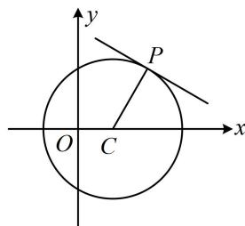

> [!faq]- 《第3节 圆的切线有关的计算》例题解析
>
> > [!success]- **【答案】** $x + \sqrt{3} y - 5 = 0$
>
> > [!note]- **【分析】**
> > 本题未单列分析。
>
> > [!note]- **【解析】**
> > 解法1：过 $P$ 能作几条切线？由点 $P$ 在圆上还是圆外决定，故先分析， $(2 - 1)^{2} + (\sqrt{3})^{2} = 4 \Rightarrow P$ 在圆 $C$ 上，故可由 $PC \perp$ 切线来算切线斜率，如图， $C(1,0)$ ， $k_{PC} = \frac{\sqrt{3} - 0}{2 - 1} = \sqrt{3} \Rightarrow$ 切线的斜率为 $-\frac{\sqrt{3}}{3}$ ，
> >
> > 所以切线方程为 $y - \sqrt{3} = -\frac{\sqrt{3}}{3} (x - 2)$ ，整理得： $x + \sqrt{3} y - 5 = 0$ .
> >
> > 解法 2: 按解法 1 判断出点 $P$ 在圆上后, 也可直接用内容提要第 4 点的结论来写切线的方程,
> >
> > 所求切线的方程为 $(2 - 1)(x - 1) + (\sqrt{3} - 0)(y - 0) = 4$ ，整理得： $x + \sqrt{3} y - 5 = 0$ .
> >
> > 
