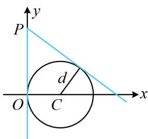

> [!faq]- 《第3节 圆的切线有关的计算》例题解析
>
> > [!success]- **【答案】** $x = 0$ 或 $3x + 4y - 8 = 0$
>
> > [!note]- **【分析】**
> > 本题未单列分析。
>
> > [!note]- **【解析】**
> > 解析：$x^{2} + y^{2} - 2x = 0\Rightarrow (x - 1)^{2} + y^{2} = 1\Rightarrow$ 圆心为 $C(1,0)$ ，半径 $r = 1$
> >
> > 如图， $P$ 在圆外，求切线可设斜率，并由 $d = r$ 求解斜率，先考虑斜率不存在的情况，
> >
> > 当 $l \perp x$ 轴时，其方程是 $x = 0$ ，由图可知满足 $l$ 与圆 $C$ 相切；
> >
> > 当 $l$ 不与 $x$ 轴垂直时，设其方程为 $y = kx + 2$ ，即 $kx - y + 2 = 0$ ①，
> >
> > 圆心 $C$ 到直线 $l$ 的距离 $d = \frac{|k + 2|}{\sqrt{k^2 + 1}}$
> >
> > 若 $l$ 与圆 $C$ 相切，则 $d = r$ ，即 $\frac{|k + 2|}{\sqrt{k^2 + 1}} = 1$ ，解得： $k = -\frac{3}{4}$
> >
> > 代入①整理得： $3x+4y-8=0$ ；
> >
> > 
> >
> > 综上所述， $l$ 的方程为 $x = 0$ 或 $3x + 4y - 8 = 0$
