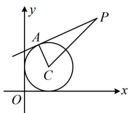

> [!faq]- 《第3节 圆的切线有关的计算》例题解析
>
> > [!success]- **【答案】** $\sqrt{7}$
>
> > [!note]- **【分析】**
> > 本题未单列分析。
>
> > [!note]- **【解析】**
> > 解析：如图，切线长 $|PA|$ 可在 $\triangle PAC$ 中由勾股定理计算，所以只需求出 $|PC|$ 即可，
> >
> > $$
> > C (1, 1) \Rightarrow | P C | = \sqrt {(3 - 1) ^ {2} + (3 - 1) ^ {2}} = 2 \sqrt {2} \Rightarrow | P A | = \sqrt {| P C | ^ {2} - r ^ {2}} = \sqrt {7}
> > $$
> >
> >
> > 
