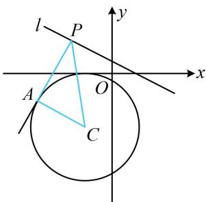

> [!faq]- 《第3节 圆的切线有关的计算》例题解析
>
> > [!success]- **【答案】** A
>
> > [!note]- **【分析】**
> > 本题未单列分析。
>
> > [!note]- **【解析】**
> > 解析：如图， $\left|PA\right|=\sqrt{\left|PC\right|^{2}-\left|AC\right|^{2}}=\sqrt{\left|PC\right|^{2}-4}$ ①，
> >
> > 要使 $|PA|$ 最小，只需 $|PC|$ 最小，而 $|PC|$ 的最小值即为点 $C(-1, -2)$ 到 l 的距离，所以 $\left|PC\right|_{\min} = \frac{\left|-1 + 2 \times (-2) - 1\right|}{\sqrt{1^2 + 2^2}} = \frac{6}{\sqrt{5}}$ ，代入①得 $\left|PA\right|_{\min} = \frac{4\sqrt{5}}{5}$ .
> >
> >
> > 
