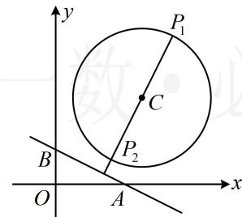
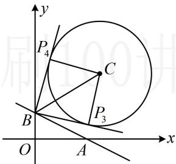

> [!faq]- 《第3节 圆的切线有关的计算》例题解析
>
> > [!success]- **【答案】** ACD
>
> > [!note]- **【分析】**
> > 本题未单列分析。
>
> > [!note]- **【解析】**
> > 解析：要判断选项 A、B，可直接画图来分析点 P 到直线 AB 距离的取值范围，先求直线 AB 的方程，由题意，直线 AB 的截距式方程为 $\frac{x}{4} + \frac{y}{2} = 1$ ，整理得： $x + 2y - 4 = 0$ ，
> >
> > 如图1，点 $P$ 到直线 $AB$ 的距离 $d$ 的最大、最小值分别在 $P_{1}$ ， $P_{2}$ 处取得，其中 $P_{1}P_{2} \perp AB$ ，因为圆心 $C(5,5)$ 到 $AB$ 的距离为 $\frac{|5 + 2 \times 5 - 4|}{\sqrt{1^2 + 2^2}} = \frac{11\sqrt{5}}{5}$ ，半径 $r = 4$ ，所以 $d_{\max} = \frac{11\sqrt{5}}{5} + 4$ ， $d_{\min} = \frac{11\sqrt{5}}{5} - 4$ ，故 $\frac{11\sqrt{5}}{5} - 4 \leq d \leq \frac{11\sqrt{5}}{5} + 4$ ，因为 $\frac{11\sqrt{5}}{5} - 4 < 2$ ， $\frac{11\sqrt{5}}{5} + 4 < 10$ ，所以A项正确，B项错误；
> >
> > 对于选项C、D，如图2，当 $\angle PBA$ 最小时， $P$ 位于 $P_{3}$ 处，当 $\angle PBA$ 最大时， $P$ 位于 $P_{4}$ 处，
> >
> > 其中 $P_{3}B$ 和 $P_{4}B$ 均与圆 $C$ 相切，且 $\left|P_{3}B\right| = \left|P_{4}B\right|$ ，它们都是切线长，可先求 $\left|BC\right|$ ，再由勾股定理求它们，因为 $\left|BC\right| = \sqrt{(5 - 0)^2 + (5 - 2)^2} = \sqrt{34}$ ，所以 $\left|P_{3}B\right| = \left|P_{4}B\right| = \sqrt{\left|BC\right|^2 - 16} = 3\sqrt{2}$ ，故 C 项和 D 项均正确.
> >
> >
> >   
> > 图1
> >
> >   
> > 图2
>
> > [!tip]- **【反思】**
> > 从例2及两个变式可以看出，算切线长，关键是算圆外的点与圆心的距离.
