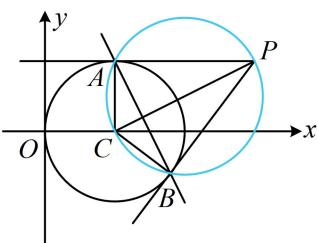

> [!faq]- 《第3节 圆的切线有关的计算》例题解析
>
> > [!success]- **【答案】** A
>
> > [!note]- **【分析】**
> > 本题未单列分析。
>
> > [!note]- **【解析】**
> > 解法1：切点弦的方程，可按两圆的公共弦来算，如图，由题意， $PA \perp AC$ ， $PB \perp BC$
> >
> > 所以 $P, C, A, B$ 四点都在以 $PC$ 为直径的圆上，
> >
> > 又 $C(1,0)$ ，所以 $PC$ 中点为 $\left(2,\frac{1}{2}\right)$ ， $\left|PC\right| = \sqrt{(3 - 1)^2 + (1 - 0)^2} = \sqrt{5}$
> >
> > 故以 $PC$ 为直径的圆的方程为 $(x - 2)^{2} + \left(y - \frac{1}{2}\right)^{2} = \frac{5}{4}$
> >
> > 与圆 C 的方程作差整理得直线 AB 的方程为 $2x + y - 3 = 0$ .
> >
> > 解法 2: 也可用内容提要第 4 点的结论,
> >
> > 
> >
> > 直线 $AB$ 的方程为 $(3 - 1)(x - 1) + 1 \times y = 1$ ，整理得： $2x + y - 3 = 0$ .
>
> > [!tip]- **【反思】**
> > 上述解法 1 的过程中，为什么用两圆方程作差就能得到公共弦 AB 所在直线的方程？因为作差得到的必为直线方程，且两交点 A, B 都满足该方程，故该方程即为公共弦 AB 所在直线的方程.
