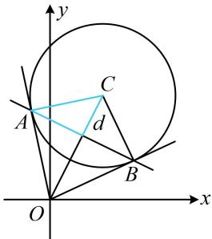

> [!faq]- 《第3节 圆的切线有关的计算》例题解析
>
> > [!success]- **【答案】** 详见解析
>
> > [!note]- **【分析】**
> > 本题未单列分析。
>
> > [!note]- **【解析】**
> > 解析：如图，可先用结论求出切点弦 $AB$ 的方程，按直线 $AB$ 被圆截得的弦长来算 $|AB|$ ，
> >
> > 由题意，切点弦 $AB$ 的方程为 $(0 - 1)(x - 1) + (0 - 2)(y - 2) = 2$ ，
> >
> > 整理得： $x + 2y - 3 = 0$ ，圆心 $C(1,2)$ 到直线 $AB$ 的距离 $d = \frac{|1 + 2\times 2 - 3|}{\sqrt{1^2 + 2^2}} = \frac{2}{\sqrt{5}}$ 所以 $\left|AB\right| = 2\sqrt{r^2 - d^2} = 2\sqrt{2 - \frac{4}{5}} = \frac{2\sqrt{30}}{5}$ 答案： $\frac{2\sqrt{30}}{5}$
> >
> > 
