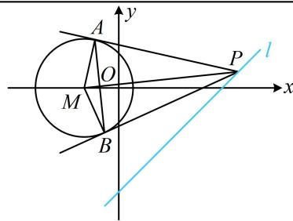

> [!faq]- 《第3节 圆的切线有关的计算》例题解析
>
> > [!success]- **【答案】** ACD
>
> > [!note]- **【分析】**
> > 本题未单列分析。
>
> > [!note]- **【解析】**
> > A. 四边形 $PAMB$ 的面积的最小值为 $2\sqrt{3}$ B. $|PA|$ 最短时，直线 $AB$ 的方程为 $x - y - 1 = 0$ C. $|PA|$ 最短时， $|AB| = \sqrt{6}$ D. 直线 $AB$ 过定点 $\left(-\frac{1}{2}, -\frac{1}{2}\right)$
> >
> > 解析：A项，如图， $M(-1,0)$ ， $\left|AM\right| = \left|BM\right| = \sqrt{2}$ ，设四边形PAMB的面积为 $S$
> >
> > $$
> > S = 2 S _ {\triangle P A M} = 2 \times \frac {1}{2} | A M | \cdot | P A | = \sqrt {2} | P A |
> > $$
> >
> > $$
> > \triangle P A M
> > $$
> >
> > $$
> > \left| P M \right|
> > $$
> >
> > $$
> > \left| P A \right| = \sqrt {\left| P M \right| ^ {2} - \left| A M \right| ^ {2}} = \sqrt {\left| P M \right| ^ {2} - 2}
> > $$
> >
> > $$
> > S = \sqrt {2} \cdot \sqrt {\left| P M \right| ^ {2} - 2} \quad ①
> > $$
> >
> > 故当 $|PM|$ 最小时，S 也最小，由图可知当 $PM \perp l$ 时， $|PM|$ 最小，故 $|PM|_{\min} = \frac{|-1 - 3|}{\sqrt{1^2 + (-1)^2}} = 2\sqrt{2}$ ，
> >
> > $$
> > S _ {\mathrm{min}} = 2 \sqrt {3}
> > $$
> >
> > B项，由 $|PA| = \sqrt{|PM|^2 - 2}$ 知 $|PA|$ 最短时， $|PM|$ 也最短，此时 $PM\perp l$
> >
> > 结合 $M(-1,0)$ 可得 $PM$ 的方程为 $y = -(x + 1)$ ，即 $x + y + 1 = 0$ ，联立 $\left\{ \begin{array}{l} x + y + 1 = 0 \\ x - y - 3 = 0 \end{array} \right.$ 解得： $\left\{ \begin{array}{l} x = 1 \\ y = -2 \end{array} \right.$ ，故 $P(1, -2)$ ，求出了点 $P$ ，就可由切点弦结论写出直线 $AB$ 的方程，
> >
> > 直线 $AB$ 的方程为 $(1 + 1)(x + 1) - 2y = 2$ ，整理得： $x - y = 0$ ，故B项错误；
> >
> > C 项， $|PA|$ 最短时，AB 的方程是 x-y=0， $|AB|$ 可按直线被圆 M 截得的弦长来算，先求 d，
> >
> > 圆心 $M$ 到直线 $AB$ 的距离 $d = \frac{|-1|}{\sqrt{1^2 + (-1)^2}} = \frac{\sqrt{2}}{2}$ ，所以 $|AB| = 2\sqrt{r^2 - d^2} = 2\sqrt{2 - \frac{1}{2}} = \sqrt{6}$ ，故C项正确；D项，找直线 $AB$ 所过定点需要 $AB$ 的方程，可先设 $P$ 的坐标，用切点弦结论来写 $AB$ 的方程， $x - y - 3 = 0 \Rightarrow y = x - 3$ ，因为点 $P$ 在直线 $y = x - 3$ 上，所以可设 $P(a, a - 3)$ ，
> >
> > 由切点弦结论，直线 $AB$ 的方程为 $(a + 1)(x + 1) + (a - 3)y = 2$ ，
> >
> > 整理得： $a(x + y + 1) + (x - 3y - 1) = 0$ ，令 $\left\{ \begin{array}{l}x + y + 1 = 0\\ x - 3y - 1 = 0 \end{array} \right.$ 解得： $\left\{ \begin{array}{l}x = -\frac{1}{2}\\ y = -\frac{1}{2} \end{array} \right.,$
> >
> > 所以直线 $AB$ 过定点 $\left(-\frac{1}{2}, -\frac{1}{2}\right)$ ，故D项正确.
> >
> >
> > 
>
> > [!tip]- **【反思】**
> > 切点弦的结论在选填题中用起来很方便，但例3解法1给出的推导方法，也需要掌握.若遇到解答题，则可用该方法来求切点弦方程.
