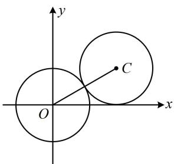
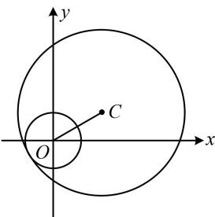

> [!faq]- 《第4节 圆与圆的位置关系》参考答案
>
> > [!success]- **【答案】** 3 或 -5
>
> > [!note]- **【分析】**
> > 本题未单列分析。
>
> > [!note]- **【解析】**
> > 解析：由题意，圆 $O$ 的圆心为原点，半径 $r_1 = 1$
> >
> > $$
> > x ^ {2} + y ^ {2} - 2 \sqrt {3} x - 2 y + m = 0 \Rightarrow (x - \sqrt {3}) ^ {2} + (y - 1) ^ {2} = 4 - m
> > $$
> >
> > 所以圆 $C$ 的圆心为 $C(\sqrt{3},1)$ ，半径 $r_2 = \sqrt{4 - m} (m < 4)$
> >
> > 故 $\left|OC\right|=\sqrt{(\sqrt{3})^{2}+1^{2}}=2$ ，
> >
> > 两圆相切，有外切和内切两种情况，需分别考虑，
> >
> > 若两圆外切，如图1，应有 $\left|OC\right|=r_{1}+r_{2}$ ，
> >
> > 所以 $2=1+\sqrt{4-m}$ ，解得：m=3；
> >
> > 若两圆内切，如图2，应有 $|OC|=r_{2}-r_{1}$ ，
> >
> > 所以 $2 = \sqrt{4 - m} - 1$ ，解得： $m = -5$
> >
> > 综上所述，实数 $m$ 的值为3或-5.
> >
> >   
> > 图1
> >
> >   
> > 图2
