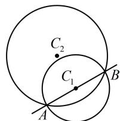

> [!faq]- 《第4节 圆与圆的位置关系》参考答案
>
> > [!success]- **【答案】** A
>
> > [!note]- **【分析】**
> > 本题未单列分析。
>
> > [!note]- **【解析】**
> > A
> > 解析： $x^{2}+y^{2}-2x+4y+4=0\Rightarrow(x-1)^{2}+(y+2)^{2}=1$ 解析： $x^{2} + y^{2} - 2x + 4y + 4 = 0\Rightarrow (x - 1)^{2} + (y + 2)^{2} = 1$ 所以圆 $C_1$ 的圆心为 $C_1(1, - 2)$ ，如图，圆 $C_2$ 平分圆 $C_1$ 的圆周，即两圆的公共弦 $AB$ 过 $C_1$ ，于是先求公共弦方程，用两圆方程作差整理得公共弦所在直线的方程为 $3x - 5y - 4 - m^2 = 0$ ，将 $C_1(1, - 2)$ 代入上式可得： $3 - 5\times (-2) - 4 - m^2 = 0$ ，结合 $m > 0$ 解得： $m = 3$
> >
> > 
