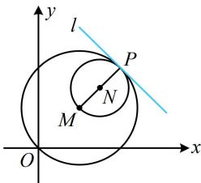

> [!faq]- 《第4节 圆与圆的位置关系》参考答案
>
> > [!success]- **【答案】** 详见解析
>
> > [!note]- **【分析】**
> > 本题未单列分析。
>
> > [!note]- **【解析】**
> > $x + y - 8 = 0$
> >
> > 解法1：公切线的条数由两圆的位置关系决定，故先判断两圆的位置关系，确定公切线有几条，
> >
> > 由题意， $M(2,2)$ ， $N(3,3)$ ， $r_1 = 2\sqrt{2}$ ， $r_2 = \sqrt{2}$
> >
> > 所以 $\left|MN\right| = \sqrt{(3 - 2)^2 + (3 - 2)^2} = \sqrt{2} = \left|r_1 - r_2\right|\Rightarrow$ 两圆内切，
> >
> > 所以两圆有且仅有1条公切线，如图中的 $l$ ，显然 $l$ 的斜率存在，设其方程为 $y = kx + b$ ，即 $kx - y + b = 0$
> >
> > 可利用圆心 $M$ ， $N$ 到 $l$ 的距离等于各自的半径来建立方程组求解 $k$ 和 $b$ ，所以 $\left\{ \begin{array}{ll}\frac{|2k - 2 + b|}{\sqrt{k^2 + 1}} = 2\sqrt{2} & ①\\ \frac{|3k - 3 + b|}{\sqrt{k^2 + 1}} = \sqrt{2} & ② \end{array} \right.$
> >
> > 从而 $\left|2k-2+b\right|=2\left|3k-3+b\right|$ ,
> >
> > 故 $2k - 2 + b = 2(3k - 3 + b)$ 或 $2k - 2 + b = -2(3k - 3 + b)$ ，
> >
> > 整理得： $b = 4 - 4k$ 或 $b = -\frac{8}{3} k + \frac{8}{3}$
> >
> > 若 $b = 4 - 4k$ ，代入①解得： $k = -1$ ，所以 $b = 8$
> >
> > 故公切线 $l$ 的方程为 $y = -x + 8$ ，即 $x + y - 8 = 0$
> >
> > 若 $b = -\frac{8}{3} k + \frac{8}{3}$ ，代入①整理得： $17k^{2} + 2k + 17 = 0$ ，无解；
> >
> > 综上所述，直线 l 的方程为 $x + y - 8 = 0$ .
> >
> > 解法2：判断两圆位置关系的过程同解法1，要求 $l$ 的方程，也可由 $MN \perp l$ 求斜率，再求点 $P$ 的坐标，
> >
> > 直线 $MN$ 的斜率 $k = \frac{3 - 2}{3 - 2} = 1$ ，所以公切线 $l$ 的斜率为-1，
> >
> > 直线 $MN$ 的方程为 $y - 2 = x - 2$ ，即 $y = x$
> >
> > 联立 $\left\{ \begin{array}{l} y = x \\ (x - 2)^2 + (y - 2)^2 = 8 \end{array} \right.$ 解得： $\left\{ \begin{array}{l} x = 4 \\ y = 4 \end{array} \right.$ 或 $\left\{ \begin{array}{l} x = 0 \\ y = 0 \end{array} \right.$ ，
> >
> > 由图可知 $P(4,4)$ ，所以直线 $l$ 的方程为 $y - 4 = -(x - 4)$
> >
> > 整理得： $x + y - 8 = 0$
> >
> > 
>
> > [!tip]- **【反思】**
> > 求公切线，除了设 $y = kx + b$ ，用两圆圆心到公切线距离等于各自半径建立方程组解 $k$ 和 $b$ 的方法外，在两圆内切的条件下，也可直接求切点和斜率.
