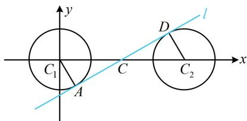

> [!faq]- 《第4节 圆与圆的位置关系》参考答案
>
> > [!success]- **【答案】** $\frac{\sqrt{3}}{3}, -\frac{2\sqrt{3}}{3}$
>
> > [!note]- **【分析】**
> > 本题未单列分析。
>
> > [!note]- **【解析】**
> > 解析：公切线的条数与两圆的位置关系有关，可先画图看看两圆的位置关系，如图，两圆相离，有4条公切线，又 $k > 0$ ，故所求为图中蓝线，注意到 $k = \tan \angle DCC_{2}$
> >
> > 于是尝试算出 $\triangle DCC_{2}$ 的三边长，快速求出 $k$
> >
> > 如图， $\left\{ \begin{array}{ll}\angle CAC_{1} = \angle CDC_{2} = 90^{\circ}\\ \angle ACC_{1} = \angle DCC_{2}\\ |AC_{1}| = |DC_{2}| = 1 \end{array} \right.\Rightarrow \triangle ACC_{1}\cong \triangle DCC_{2},$
> >
> > 所以 $\left|CC_{1}\right|=\left|CC_{2}\right|$ ，故C为 $C_{1}C_{2}$ 中点，
> >
> > 由题意， $C_1(0,0)$ ， $C_2(4,0)$ ，所以 $\left|CC_2\right| = 2$
> >
> > 从而 $\left|CD\right|=\sqrt{\left|CC_{2}\right|^{2}-\left|DC_{2}\right|^{2}}=\sqrt{3}$ ，
> >
> > 故直线 $l$ 的斜率 $k = \tan \angle DCC_{2} = \frac{|DC_{2}|}{|CD|} = \frac{\sqrt{3}}{3}$
> >
> > 此时若再求出 C 的坐标，就可写出 l 的方程，求得 b，
> >
> > 由 $C$ 为 $C_1C_2$ 中点知 $C(2,0)$ ，所以 $l$ 的方程为
> >
> > $y = \frac{\sqrt{3}}{3} (x - 2)$ ，即 $y = \frac{\sqrt{3}}{3} x - \frac{2\sqrt{3}}{3}$ ，故 $b = -\frac{2\sqrt{3}}{3}$
> >
> > 
>
> > [!tip]- **【反思】**
> > 本题当然也可由 $C_1$ ， $C_2$ 到 $l$ 的距离都等于1来建立方程组求解 $k$ 和 $b$ ，但此法计算量大，所以在图形比较特殊的情况下，运用几何关系来计算公切线更简单.
