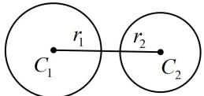
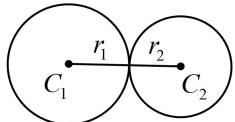
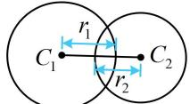
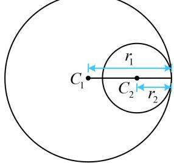
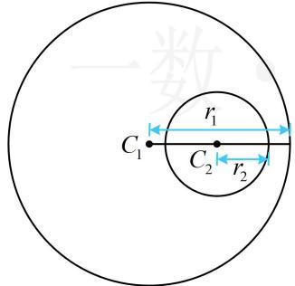

<!-- source-part:1 pages:1-6 -->

# 第4节 圆与圆的位置关系（★★☆）

## 内容提要

1. 设圆 $C_1$ 和圆 $C_2$ 的半径分别为 $r_1, r_2$ ，则两圆的位置关系的判断方法如下表：

<table><tr><td>位置关系</td><td>图形</td><td>判断依据</td><td>交点个数</td><td>公切线条数</td></tr><tr><td>外离</td><td></td><td> $|C_1C_2| > r_1 + r_2$ </td><td>无交点</td><td>4条</td></tr><tr><td>外切</td><td></td><td> $|C_1C_2| = r_1 + r_2$ </td><td>1个</td><td>3条</td></tr><tr><td>相交</td><td></td><td> $|r_1 - r_2| < |C_1C_2| < r_1 + r_2$ </td><td>2个</td><td>2条</td></tr><tr><td>内切</td><td></td><td> $|C_1C_2| = |r_1 - r_2|$ </td><td>1个</td><td>1条</td></tr><tr><td>内含</td><td></td><td> $|C_1C_2| < |r_1 - r_2|$ </td><td>无交点</td><td>无公切线</td></tr></table>

2. 公共弦方程: 当两圆相交时, 它们的公共弦所在直线的方程可用两圆方程作差消去平方项获得. 因为作差得到的必为直线方程, 且两交点都满足该方程, 故该方程即为公共弦的方程.

![[高中/总复习/教辅/一数常规版2026/第10章 解析几何/模块2 圆与方程/第4节 圆与圆的位置关系/类型01_圆与圆的位置关系/类型01_圆与圆的位置关系.md]]
![[高中/总复习/教辅/一数常规版2026/第10章 解析几何/模块2 圆与方程/第4节 圆与圆的位置关系/类型02_两圆公切线有关问题/类型02_两圆公切线有关问题.md]]
![[高中/总复习/教辅/一数常规版2026/第10章 解析几何/模块2 圆与方程/第4节 圆与圆的位置关系/类型03_公共弦相关问题/类型03_公共弦相关问题.md]]
![[高中/总复习/教辅/一数常规版2026/第10章 解析几何/模块2 圆与方程/第4节 圆与圆的位置关系/强化训练/强化训练.md]]
