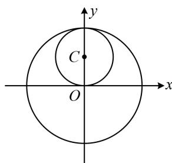

> [!faq]- 《第4节 圆与圆的位置关系》例题解析
>
> > [!success]- **【答案】** A
>
> > [!note]- **【分析】**
> > 本题未单列分析。
>
> > [!note]- **【解析】**
> > A. 内切 B. 相交 C. 外切 D. 内含
> >
> > 解析：判断圆与圆的位置关系，只需计算圆心距，并与半径的和、差比较， $x^{2} + y^{2} - 2y = 0 \Rightarrow x^{2} + (y - 1)^{2} = 1 \Rightarrow$ 圆 $C$ 的圆心为 $C(0,1)$ ，半径 $r_1 = 1$ 又圆 $O$ 的圆心为原点，半径 $r_2 = 2$ ，所以圆心距 $|OC| = 1 = |r_1 - r_2|$ ，故圆 $C$ 与圆 $O$ 内切，如图.
> >
> >
> > 
