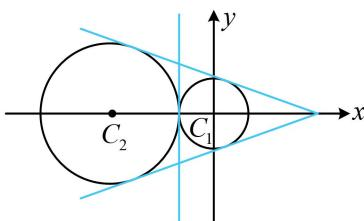

> [!faq]- 《第4节 圆与圆的位置关系》例题解析
>
> > [!success]- **【答案】** C
>
> > [!note]- **【分析】**
> > 本题未单列分析。
>
> > [!note]- **【解析】**
> > 解析：两圆公切线的条数与两圆的位置关系有关，故先判断两圆的位置关系，
> >
> > 由题意， $C_1(0,0)$ ， $r_1 = 1$ ， $C_2(-3,0)$ ， $r_2 = 2$ ，所以 $\left|C_1C_2\right| = 3 = r_1 + r_2$
> >
> > 故两圆外切，有3条公切线，如图.
>
> > [!tip]- **【反思】**
> > 判断圆与圆公切线的条数，本质就是判断两圆的位置关系.
> >
> > 
