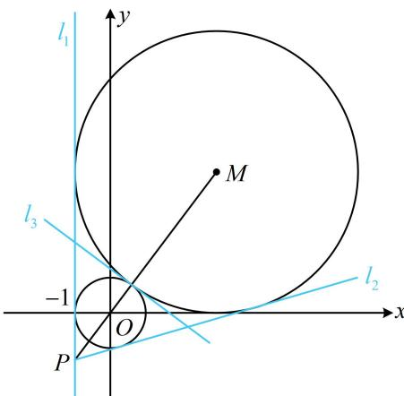

> [!faq]- 《第4节 圆与圆的位置关系》例题解析
>
> > [!success]- **【答案】** $x = -1$ （答案不唯一，也可填 $3x + 4y - 5 = 0$ ，或 $7x - 24y - 25 = 0$ ）
>
> > [!note]- **【分析】**
> > 本题未单列分析。
>
> > [!note]- **【解析】**
> > 解析：两个圆如图，它们的半径分别为1和4，圆心分别为原点 $O$ 和 $M(3,4)$ ，
> >
> > 所以圆心距 $\left|OM\right|=\sqrt{3^{2}+4^{2}}=5=1+4$ ，从而两圆外切，故两圆共有三条公切线，如图中的 $l_{1}$ ， $l_{2}$ ， $l_{3}$ ，求公切线可设斜率，先考虑斜率不存在的情况，结合图象可得x=-1是两圆的一条公切线，即图中的 $l_{1}$ ，本题只需填一条公切线，做到这里已经可以结束了，但我们把另外两条公切线也求一下，
> >
> > 若公切线的斜率存在，则可设其方程为 $y = kx + b$ ，即 $kx - y + b = 0$ ①，
> >
> > 因为该直线与两圆都相切，所以 $\frac{|b|}{\sqrt{k^2 + 1}} = 1$ ②， $\frac{|3k - 4 + b|}{\sqrt{k^2 + 1}} = 4$ ③，对比②③得 $|3k - 4 + b| = 4|b|$ ，所以 $3k - 4 + b = 4b$ 或 $3k - 4 + b = -4b$ 整理得： $b = k - \frac{4}{3}$ 或 $b = \frac{4}{5} - \frac{3}{5} k$ 若 $b = k - \frac{4}{3}$ ，代入②解得： $k = \frac{7}{24}$ ，所以 $b = k - \frac{4}{3} = -\frac{25}{24}$ ，代入①整理得： $7x - 24y - 25 = 0$ ；若 $b = \frac{4}{5} - \frac{3}{5} k$ ，代入②解得： $k = -\frac{3}{4}$ ，所以 $b = \frac{4}{5} - \frac{3}{5} k = \frac{5}{4}$ ，代入①整理得： $3x + 4y - 5 = 0$ ；
> >
> > 
> >
> > 综上所述，与两圆都相切的直线有 $x = -1$ ， $7x - 24y - 25 = 0$ ， $3x + 4y - 5 = 0$ ，任选其一填入横线即可.
>
> > [!tip]- **【反思】**
> > 求两圆公切线方程的步骤: ①判断两圆的位置关系, 确定公切线条数;
> > - **②**：设公切线方程为 $y = kx + b$ (要讨论斜率不存在的情形);
> > - **③**：利用两圆圆心到公切线的距离等于各自半径, 建立方程组求 $k$ 和 $b$ .
