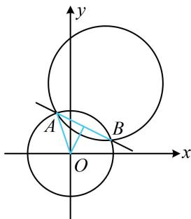

> [!faq]- 《第4节 圆与圆的位置关系》例题解析
>
> > [!success]- **【答案】** $\pm \frac{\sqrt{10}}{4}$
>
> > [!note]- **【分析】**
> > 本题未单列分析。
>
> > [!note]- **【解析】**
> > 解析：如图，把公共弦看成直线 $AB$ 被圆 $O$ 截得的弦，可用弦长公式 $L = 2\sqrt{r^2 - d^2}$ 来算，先求 $AB$ 的方程，
> >
> > 用两圆方程作差整理得直线 $AB$ 的方程为 $2ax + 4ay - 5 = 0$
> >
> > 点 $O$ 到直线 $AB$ 的距离 $d = \frac{|-5|}{\sqrt{(2a)^2 + (4a)^2}} = \frac{\sqrt{5}}{2|a|}$
> >
> > 所以公共弦长 $|AB|=2\sqrt{4-\frac{5}{4a^{2}}}=2\sqrt{2}$ ，解得： $a=\pm\frac{\sqrt{10}}{4}$
> >
> > 经检验，均满足所给两圆相交.
> >
> > 
>
> > [!tip]- **【反思】**
> > 计算两圆的公共弦长，可先求公共弦所在直线的方程，再按直线被其中一个圆截得的弦长来算.
