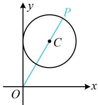

> [!faq]- 《第5节 圆中最值问题》参考答案
>
> > [!success]- **【答案】** C
>
> > [!note]- **【分析】**
> > 本题未单列分析。
>
> > [!note]- **【解析】**
> > 解析：涉及圆上动点与定点的距离最值问题，先判断定点在圆内还是圆外，因为 $(0 - 1)^2 + (0 - b)^2 = 1 + b^2 > 1$ ，所以点 $O$ 在圆 $C$ 外，
> >
> > 可按内容提要中的模型1处理，如图所示即为 $|OP|$ 最大的情形，圆心为 $C(1,b)$ ，所以 $|OP|_{\max} = |OC| + 1 = \sqrt{1 + b^2} + 1$ ，由题意， $\sqrt{1 + b^2} + 1 = 3$ ，结合 $b > 0$ 可得 $b = \sqrt{3}$ .
> >
> > 
> >
> > 已知半径为2的圆过点(5,12)，则其圆心到原点的距离的最小值为（）
> > A. 10 B. 11 C. 12 D. 13
