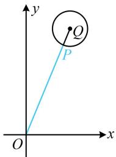

> [!faq]- 《第5节 圆中最值问题》参考答案
>
> > [!success]- **【答案】** B
>
> > [!note]- **【分析】**
> > 本题未单列分析。
>
> > [!note]- **【解析】**
> > B
> > 解析：本题圆心是动点，先求出圆心的运动轨迹，
> > 设圆心为 $P(x,y)$ ，记 $Q(5,12)$ ，由题意， $\sqrt{(x-5)^{2}+(y-12)^{2}}=2$ ，所以 $(x-5)^{2}+(y-12)^{2}=4$ 故圆心 P 可在以 $Q(5,12)$ 为圆心，2 为半径的圆上运动，
> > 如图，原点在该圆外，属内容提要中的模型1，
> > 因为 $|OQ|=\sqrt{5^{2}+12^{2}}=13$ ，所以圆心P到原点距离的最小值为 $|OQ|-2=11$ 。
> >
> > 
> >
> > 圆 $C: x^{2} + y^{2} - 4x - 4y - 10 = 0$ 上的点 $P$ 到直线 $l: x + y - 14 = 0$ 的最大距离与最小距离之和为（）A. 30 B. 18 C. $10\sqrt{2}$ D. $5\sqrt{2}$
