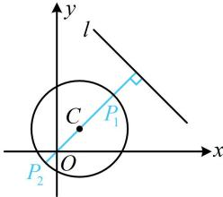

> [!faq]- 《第5节 圆中最值问题》参考答案
>
> > [!success]- **【答案】** C
>
> > [!note]- **【分析】**
> > 本题未单列分析。
>
> > [!note]- **【解析】**
> > C
> > 解析： $x^{2}+y^{2}-4x-4y-10=0\Rightarrow(x-2)^{2}+(y-2)^{2}=18$ 所以圆 C 的圆心为 $C(2,2)$ ，半径 $r=3\sqrt{2}$ ，
> > 故圆心 C 到直线 l 的距离 $d=\frac{|2+2-14|}{\sqrt{1^{2}+1^{2}}} = 5\sqrt{2} > r$ 直线 $l$ 与圆 $C$ 相离，属内容提要中的模型3， $P$ 到 $l$ 的距离最小、最大的情形如图中的 $P_{1}$ ， $P_{2}$ ，圆 $C$ 上的点到直线 $l$ 的最大距离为 $d + r$ ，最小距离为 $d - r$ ，它们的和为 $2d = 10\sqrt{2}$ 。
> >
> > 
