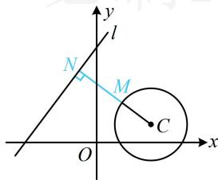

> [!faq]- 《第5节 圆中最值问题》参考答案
>
> > [!success]- **【答案】** D
>
> > [!note]- **【分析】**
> > 本题未单列分析。
>
> > [!note]- **【解析】**
> > D
> >
> > 解析：先判断直线与圆的位置关系．观察发现若调整 t，则 l 可上下平移，三种位置关系均有可能，故分别考虑，若直线与圆有交点，则当 M，N 取同一交点时， $|MN|=0$ ，不合题意，所以直线与圆只能相离，
> > 如图，当 $|MN|$ 最小时，必有 $MN \perp l$ ，故只需求点 M 到 l 距离的最小值，可按内容提要中的模型 3 处理，
> > 圆心 C(3,1) 到直线 l 的距离 $d=\frac{|4\times3-3\times1+t|}{\sqrt{4^{2}+(-3)^{2}}}=\frac{|9+t|}{5}$ 所以 $\left|MN\right|_{\min}=d-r=\frac{\left|9+t\right|}{5}-2$ 由题意， $\frac{|9+t|}{5}-2=7$ ，解得：t=-54 或 36.
> >
> > 
