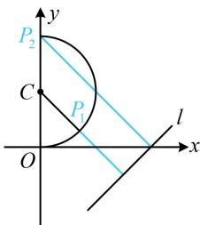

> [!faq]- 《第5节 圆中最值问题》参考答案
>
> > [!success]- **【答案】** D
>
> > [!note]- **【分析】**
> > 本题未单列分析。
>
> > [!note]- **【解析】**
> > 解析：曲线 $C$ 的方程有根号，先平方去根号， $x = \sqrt{1 - (y - 1)^2} \Rightarrow x^2 = 1 - (y - 1)^2 \Rightarrow x^2 + (y - 1)^2 = 1 (x \geq 0)$ ，曲线 $C$ 为如图所示的半圆，圆心为 $C(0,1)$ ，半径 $r = 1$ ，点 $C$ 到直线 $l$ 的距离的 $d = \frac{|-1 - 2|}{\sqrt{1^2 + (-1)^2}} = \frac{3\sqrt{2}}{2} > r$ ，
> >
> > 直线 $l$ 与半圆 $C$ 相离， $P$ 到 $l$ 的距离的最小值在图中 $P_{1}$ 处取，但由于是半圆，所以最大值在 $P_{2}$ 处取，所以 $b = d - r = \frac{3\sqrt{2}}{2} - 1$
> >
> > 又 $P_{2}(0,2)$ ，所以 $a = \frac{| - 2 - 2|}{\sqrt{1^2 + (-1)^2}} = 2\sqrt{2}$ ，故 $a - b = \frac{\sqrt{2}}{2} +1$
> >
> > 
