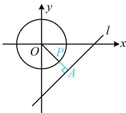

> [!faq]- 《第5节 圆中最值问题》参考答案
>
> > [!success]- **【答案】** C
>
> > [!note]- **【分析】**
> > 本题未单列分析。
>
> > [!note]- **【解析】**
> > 解析：点 $A$ 的坐标含参，是动点，先消去参数看看点 $A$ 的运动轨迹，设 $A(x,y)$ ，则 $\left\{ \begin{array}{l} x = m \\ y = m - 3 \end{array} \right.$ ，两式作差消去 $m$ 整理得： $x - y - 3 = 0$ ，所以 $A$ 是直线 $l: x - y - 3 = 0$ 上的动点，对圆 $O$ 上任意的点 $P$ ， $A$ 在 $l$ 上运动，总有当 $AP \perp l$ 时， $|PA|$ 最小，故只需求 $P$ 到直线 $l$ 距离的最小值，如图，圆心 $O$ 到直线 $l$ 的距离 $d = \frac{|-3|}{\sqrt{1^2 + (-1)^2}} = \frac{3\sqrt{2}}{2}$ ，所以 $\left|PA\right|_{\min} = d - r = \frac{3\sqrt{2}}{2} - \sqrt{2} = \frac{\sqrt{2}}{2}$ .
> >
> > 
