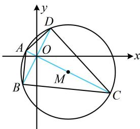

> [!faq]- 《第5节 圆中最值问题》参考答案
>
> > [!success]- **【答案】** B
>
> > [!note]- **【分析】**
> > 本题未单列分析。
>
> > [!note]- **【解析】**
> > ## 7. (2022·云南昆明模拟·★★★)
> >
> > 在圆 $M: x^{2} + y^{2} - 4x + 2y - 4 = 0$ 内，过点 $O(0,0)$ 的最长弦和最短弦分别是 $AC$ ， $BD$ ，则四边形 $ABCD$ 的面积为（）A. 24 B. 12 C. 10 D. 8
> >
> > $$
> > x ^ {2} + y ^ {2} - 4 x + 2 y - 4 = 0 \Rightarrow (x - 2) ^ {2} + (y + 1) ^ {2} = 9
> > $$
> >
> > 所以圆心为 $M(2,-1)$ ，半径 r=3，
> >
> > 如图，原点 $O$ 在圆内，属内容提要中的模型5，最长弦 $AC$ 是直径，最短弦 $BD$ 是与 $OM$ 垂直的弦，所以 $\left|AC\right| = 6$ ，又 $\left|OM\right| = \sqrt{2^2 + (-1)^2} = \sqrt{5}$ 所以 $\left|BD\right| = 2\sqrt{r^2 - \left|OM\right|^2} = 4$ 故四边形ABCD的面积 $S = \frac{1}{2}\left|AC\right|\cdot \left|BD\right| = \frac{1}{2}\times 6\times 4 = 12.$
> >
> > 
