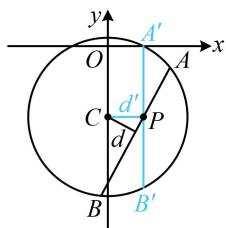

> [!faq]- 《第5节 圆中最值问题》参考答案
>
> > [!success]- **【答案】** C
>
> > [!note]- **【分析】**
> > 本题未单列分析。
>
> > [!note]- **【解析】**
> > C
> > 解法1：涉及直线被圆截得的弦长，考虑用弦长公式 $L=2\sqrt{r^{2}-d^{2}}$ 计算，下面分别求r和d， $x^{2}+y^{2}+4y-1=0\Rightarrow x^{2}+(y+2)^{2}=5$ 所以圆的圆心为 $(0,-2)$ ，半径 $r=\sqrt{5}$ 圆心到直线 $ax + by + c = 0$ 的距离 $d = \frac{|-2b + c|}{\sqrt{a^{2} + b^{2}}}$ 所以 $\left|AB\right|=2\sqrt{r^{2}-d^{2}}=2\sqrt{5-\frac{(-2b+c)^{2}}{a^{2}+b^{2}}}$ $=2\sqrt{\frac{5a^{2}+b^{2}+4bc-c^{2}}{a^{2}+b^{2}}}$ ①,
> > 涉及的变量较多，考虑消元，还有 b 是 a, c 的等差中项没翻译，先翻译它，建立 a, b, c 的关系，由题意， $2b=a+c$ ，所以 c=2b-a，代入①得
> >
> > $$
> > \left| A B \right| = 2 \sqrt {\frac {5 a ^ {2} + b ^ {2} + 4 b (2 b - a) - (2 b - a) ^ {2}}{a ^ {2} + b ^ {2}}} = 2 \sqrt {\frac {4 a ^ {2} + 5 b ^ {2}}{a ^ {2} + b ^ {2}}}
> > $$
> >
> > $$
> > = 2 \sqrt {\frac {4 (a ^ {2} + b ^ {2}) + b ^ {2}}{a ^ {2} + b ^ {2}}} = 2 \sqrt {4 + \frac {b ^ {2}}{a ^ {2} + b ^ {2}}} \geq 2 \sqrt {4} = 4,
> > $$
> >
> > 取等条件是 $b = 0$ ，满足题意，所以 $\vert AB\vert$ 的最小值为4.
> >
> > 解法2：所给直线含参，也可先翻译 $b$ 是 $a, c$ 的等差中项，找到参数的关系，看看直线有什么特征，
> >
> > 因为 $b$ 是 $a, c$ 的等差中项，所以 $2b = a + c$ ，故 $c = 2b - a$
> >
> > 代入 $ax + by + c = 0$ 得 $ax + by + 2b - a = 0$
> >
> > 即 $a(x - 1) + b(y + 2) = 0$ ②，
> >
> > 我们发现该直线过定点，有明显的图形特征，故接下来可考虑画图分析，分析圆心和半径的过程同解法1，
> >
> > 由②知直线过定点 $P(1, -2)$ ，
> >
> > 根据 $\left|AB\right|=2\sqrt{r^{2}-d^{2}}=2\sqrt{5-d^{2}}$ ，要使 $\left|AB\right|$ 最小，只需d最大，如图，当AB绕点P旋转时，总有 $d\leq d'$ ，当且仅当AB与图中 $A'B'$ 重合时取等号，此时， $AB\perp CP$ ，
> >
> > 所以 $d_{\mathrm{max}} = |CP| = 1$ ，故 $\left|AB\right|_{\mathrm{min}} = 2\sqrt{5 - 1^2} = 4.$
> >
> > 
> >
> > 一数·必刷100讲
