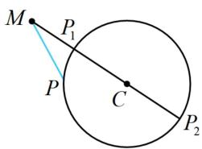
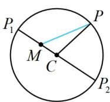
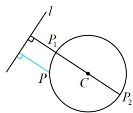
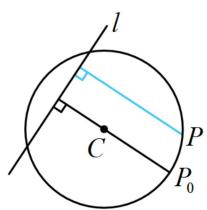
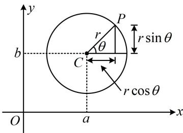

<!-- source-part:1 pages:1-7 -->

## 第5节 圆中最值问题（★★★）

## 内容提要

圆中的最值问题一般有两种处理方法：几何法、代数法.

1. 几何法：五个基本模型（下述 $r$ 均为圆 $C$ 的半径）

① 模型 1: 如图 1, $M$ 为圆 $C$ 外一定点, $P$ 为圆 $C$ 上的动点, 则 $\left|MC\right| - r \leq \left|PM\right| \leq \left|MC\right| + r$ , 当 $P$ 分别位于图中 $P_{1}$ 和 $P_{2}$ 处时, 左右两边分别取等号.

②模型2：如图2， $M$ 为圆 $C$ 内一定点， $P$ 为圆 $C$ 上的动点，则 $\left\{ \begin{array}{l} |PM| + |CM| \geq |PC| \\ |PM| - |CM| \leq |PC| \end{array} \right.$ ，所以 $\left\{ \begin{array}{l} |PM| \geq |PC| - |CM| = r - |CM| \\ |PM| \leq |PC| + |CM| = r + |CM| \end{array} \right.$ ，故 $r - |CM| \leq |PM| \leq r + |CM|$ ，当 $P$ 分别位于图中 $P_{1}$ 和 $P_{2}$ 处时，左右两边分别取等号.

③模型3: 如图3, 设直线 $l$ 与圆 $C$ 相离, 圆心 $C$ 到直线 $l$ 的距离为 $d$ , 则圆上动点 $P$ 到直线 $l$ 的距离的取值范围为 $[d - r, d + r]$ , 其中 $d - r$ 和 $d + r$ 分别在图中的 $P_{1}$ , $P_{2}$ 处取得.

④模型4：如图4，设直线 $l$ 与圆 $C$ 相交，圆心 $C$ 到直线 $l$ 的距离为 $d$ ，则圆上动点 $P$ 到直线 $l$ 的距离的最大值在 $P_{0}$ 处取得，且最大值为 $d + r$ ：

⑤模型5: 如图5, 过圆 $C$ 内一定点 $P$ 作圆的弦, 则最长的弦为圆的直径, 那最短的弦呢? 我们知道弦长 $L = 2\sqrt{r^2 - d^2}$ , 所以要使 $L$ 最小, 则需 $d$ 最大, 此时的弦应与 $PC$ 垂直, 如图中的 $AB$ , 因为若弦不与 $PC$ 垂直, 如图中的 $A'B'$ , 则圆心到弦 $A'B'$ 的距离 $d$ 是图中阴影三角形的一条直角边, 必定小于斜边 $PC$ , 而对于弦 $AB$ , 圆心 $C$ 到它的距离即为 $|PC|$ , 所以当弦垂直于 $PC$ 时, $d$ 最大, 弦长 $L$ 最小.

  
图1

  
图2

  
图3

  
图4

  
图5

2. 代数法：设圆 $C: (x - a)^2 + (y - b)^2 = r^2 (r > 0)$ ，可将其方程变形成 $\left(\frac{x - a}{r}\right)^2 + \left(\frac{y - b}{r}\right)^2 = 1$

在三角函数那部分，我们知道 $\cos^2\theta +\sin^2\theta = 1$ ，所以可据此进行三角换元，令 $\left\{ \begin{array}{l} \frac{x - a}{r} = \cos \theta \\ \frac{y - b}{r} = \sin \theta \end{array} \right.$ ，从而 $\left\{ \begin{array}{l} x = a + r\cos \theta \\ y = b + r\sin \theta \end{array} \right.$ ，故对于圆 $C$ 上的动点 $P$ ，可将其坐标设为 $(a + r\cos \theta, b + r\sin \theta)$ （这种设法中 $\theta$ 的几何意义可参考下图），将求最值的目标表示成关于 $\theta$ 的三角函数，借助三角函数求最值.

![[高中/总复习/教辅/一数常规版2026/第10章 解析几何/模块2 圆与方程/第5节 圆中最值问题/类型01_圆上动点与定点距离的最值问题/类型01_圆上动点与定点距离的最值问题.md]]
![[高中/总复习/教辅/一数常规版2026/第10章 解析几何/模块2 圆与方程/第5节 圆中最值问题/类型02_圆上动点与直线的距离最值问题/类型02_圆上动点与直线的距离最值问题.md]]
![[高中/总复习/教辅/一数常规版2026/第10章 解析几何/模块2 圆与方程/第5节 圆中最值问题/类型03_圆内过定点的弦长最值/类型03_圆内过定点的弦长最值.md]]
![[高中/总复习/教辅/一数常规版2026/第10章 解析几何/模块2 圆与方程/第5节 圆中最值问题/类型04_三角换元求最值/类型04_三角换元求最值.md]]
![[高中/总复习/教辅/一数常规版2026/第10章 解析几何/模块2 圆与方程/第5节 圆中最值问题/强化训练/强化训练.md]]
