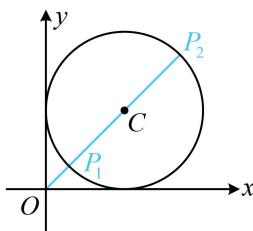

> [!faq]- 《第5节 圆中最值问题》例题解析
>
> > [!success]- **【答案】** $[\sqrt{2} -1,\sqrt{2} +1]$
>
> > [!note]- **【分析】**
> > 本题未单列分析。
>
> > [!note]- **【解析】**
> > 解析：如图，原点 $O$ 在圆 $C$ 外，属内容提要中的模型 1，
> >
> > 由图可知， $|OP|$ 的最小值在 $P_{1}$ 处取得，最大值在 $P_{2}$ 处取得，
> >
> > 由题意， $C(1,1)$ ，圆 $C$ 的半径 $r = 1$ ，所以 $\left|OC\right| = \sqrt{2}$
> >
> > 从而 $\left|OP_{1}\right|=\left|OC\right|-r=\sqrt{2}-1,\quad\left|OP_{2}\right|=\left|OC\right|+r=\sqrt{2}+1$ ，故 $\left|OP\right|\in[\sqrt{2}-1,\sqrt{2}+1]$ .
> >
> >
> > 
