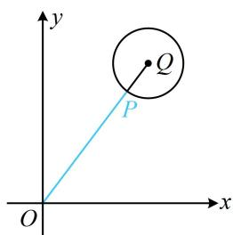

> [!faq]- 《第5节 圆中最值问题》例题解析
>
> > [!success]- **【答案】** A
>
> > [!note]- **【分析】**
> > 本题未单列分析。
>
> > [!note]- **【解析】**
> > 解析：本题圆心是动点，先求出圆心的运动轨迹，设圆心为 $P(x,y)$ ，记 $Q(3,4)$ ，由题意， $|PQ| = \sqrt{(x - 3)^2 + (y - 4)^2} = 1$ ，所以 $(x - 3)^2 + (y - 4)^2 = 1$ ，故圆心可在以 $Q(3,4)$ 为圆心，1为半径的圆上运动，原点在该圆外，属内容提要中的模型1， $|OP|$ 最小的情形如图所示，因为 $|OQ| = \sqrt{3^2 + 4^2} = 5$ ，所以圆心 $P$ 到原点距离的最小值为 $|OQ| - 1 = 4$ 。答案：A
> >
> > 
