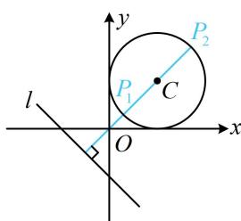

> [!faq]- 《第5节 圆中最值问题》例题解析
>
> > [!success]- **【答案】** $\left[\frac{3\sqrt{2}}{2} -1,\frac{3\sqrt{2}}{2} +1\right]$
>
> > [!note]- **【分析】**
> > 本题未单列分析。
>
> > [!note]- **【解析】**
> > 解析：如图，直线 l 与圆 C 相离，属内容提要中的模型 3，P 到 l 距离最小、最大的情形如图中 $P_{1}$ ， $P_{2}$ ，
> >
> > 圆心 $C(1,1)$ 到直线 $l$ 的距离 $d = \frac{|1 + 1 + 1|}{\sqrt{1^2 + 1^2}} = \frac{3\sqrt{2}}{2}$ ，所以点 $P$ 到直线 $l$ 的距离的取值范围为 $\left[\frac{3\sqrt{2}}{2} - 1, \frac{3\sqrt{2}}{2} + 1\right]$ .
> >
> > 
