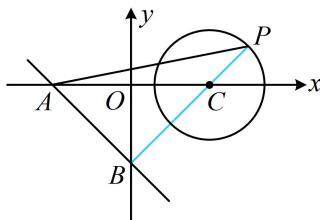

> [!faq]- 《第5节 圆中最值问题》例题解析
>
> > [!success]- **【答案】** A
>
> > [!note]- **【分析】**
> > 本题未单列分析。
>
> > [!note]- **【解析】**
> > A. [2,6] B. [4,8] C. $[\sqrt{2}, 3\sqrt{2}]$ D. $[2\sqrt{2}, 3\sqrt{2}]$
> >
> > 解析：在 $x + y + 2 = 0$ 中令 $x = 0$ 得 $y = -2$ ，令 $y = 0$ 得 $x = -2$ ，所以 $A(-2,0)$ ， $B(0,-2)$ ，故 $\left|AB\right| = 2\sqrt{2}$ 记 $\triangle ABP$ 的 $AB$ 边上的高为 $h$ ，则 $S_{\triangle ABP} = \frac{1}{2}\left|AB\right|\cdot h = \sqrt{2} h$
> >
> > 下面先求 $h$ 的范围，如图，直线 $AB$ 与圆 $C$ 相离，属内容提要中的模型3，圆心 $C(2,0)$ 到直线 $AB$ 的距离 $d = \frac{|2 + 2|}{\sqrt{1^2 + 1^2}} = 2\sqrt{2}$ ，当 $P$ 在圆 $C$ 上运动时，有 $d - r \leq h \leq d + r$ ，所以 $\sqrt{2} \leq h \leq 3\sqrt{2}$ ，故 $2 \leq S_{\triangle ABP} = \sqrt{2}h \leq 6$ .
> >
> > 
>
> > [!tip]- **【反思】**
> > 本题也可设点 P 的坐标为 $(2 + \sqrt{2} \cos \theta, \sqrt{2} \sin \theta)$ ，用三角的方法来求 h 的取值范围，不妨试试.
