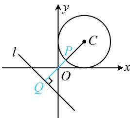

> [!faq]- 《第5节 圆中最值问题》例题解析
>
> > [!success]- **【答案】** 详见解析
>
> > [!note]- **【分析】**
> > 本题未单列分析。
>
> > [!note]- **【解析】**
> > 解析：涉及两个动点，考虑先取定一个来看，不妨先取定点 $P$ ，分析 $Q$ 的运动情况，
> >
> > 如图，对于圆 $C$ 上任意的点 $P$ ，当 $Q$ 在直线 $l$ 上运动时， $|PQ|$ 的最小值总是在 $PQ \perp l$ 时取得，
> >
> > 所以问题等价于求点 P 到直线 l 距离的最小值，直线 l 与圆 C 相离，可按内容提要中的模型 3 处理，
> >
> > 圆心 $C(1,1)$ 到直线 $l$ 的距离 $d = \frac{|1 + 1 + 1|}{\sqrt{1^2 + 1^2}} = \frac{3\sqrt{2}}{2} \Rightarrow |PQ|_{\min} = d - r = \frac{3\sqrt{2}}{2} - 1.$ 答案： $\frac{3\sqrt{2}}{2} - 1$
> >
> > 
