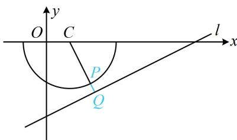

> [!faq]- 《第5节 圆中最值问题》例题解析
>
> > [!success]- **【答案】** C
>
> > [!note]- **【分析】**
> > 本题未单列分析。
>
> > [!note]- **【解析】**
> > 解析：直接代两点间距离公式较复杂，可考虑画图来看，所给函数解析式有根号，先平方去根号， $y = -\sqrt{4 - (x - 1)^2} \Rightarrow y^2 = 4 - (x - 1)^2 \Rightarrow (x - 1)^2 + y^2 = 4 (y \leq 0)$ ，所以点 $P$ 在如图所示的半圆 $C$ 上运动，点 $Q$ 的坐标含参，是动点，先消去参数看看点 $Q$ 的运动轨迹，
> >
> > 设 $Q(x,y)$ ，则 $\left\{ \begin{array}{ll}x = 2a & ①\\ y = a - 3 & ② \end{array} \right.$ ，由 $②$ 得 $a = y + 3$ ，代入 $①$ 整理得： $x - 2y - 6 = 0$
> >
> > 所以 $Q$ 是直线 $l: x - 2y - 6 = 0$ 上的动点，
> >
> > 对半圆上任意的点 $P$ ，当 $Q$ 在 $l$ 上运动时， $|PQ|$ 的最小值总是在 $PQ \perp l$ 时取得，故可按内容提要的模型3处理，
> >
> > 
> >
> > 如图，点 $C(1,0)$ 到直线 $l$ 的距离 $d = \frac{|1 - 6|}{\sqrt{5}} = \sqrt{5}$ ，所以 $\left|PQ\right|_{\min} = \sqrt{5} - 2$ 。
>
> > [!tip]- **【反思】**
> > 当点 $P$ 的坐标含参时，例如 $P(f(a), g(a))$ ，则可设 $P(x, y)$ ，由 $\left\{ \begin{array}{l} x = f(a) \\ y = g(a) \end{array} \right.$ 消去参数 $a$ 得到关于 $x$ 和 $y$ 的方程，从而找到点 $P$ 的运动轨迹.
