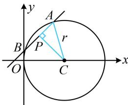

> [!faq]- 《第5节 圆中最值问题》例题解析
>
> > [!success]- **【答案】** B
>
> > [!note]- **【分析】**
> > 本题未单列分析。
>
> > [!note]- **【解析】**
> > 解析：$x^{2} + y^{2} - 6x = 0\Rightarrow (x - 3)^{2} + y^{2} = 9$ ，所以圆心为 $C(3,0)$ ，半径 $r = 3$ 记 $P(1,2)$ ，过点 $P$ 的弦为 $AB$ ，因为 $1^{2} + 2^{2} - 6\times 1 = -1 <   0$ ，所以点 $P$ 在圆 $C$ 内，故可按内容提要中的模型5处理，如图，当弦 $AB\bot PC$ 时， $\vert AB\vert$ 最小，因为 $\left|PC\right| = \sqrt{(1 - 3)^2 + (2 - 0)^2} = 2\sqrt{2}$ ，所以 $\left|AB\right|_{\min} = 2\sqrt{r^2 - \left|PC\right|^2} = 2.$
> >
> > 
