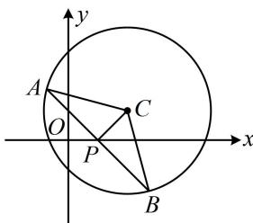

> [!faq]- 《第5节 圆中最值问题》例题解析
>
> > [!success]- **【答案】** C
>
> > [!note]- **【分析】**
> > 本题未单列分析。
>
> > [!note]- **【解析】**
> > 解析：$x^{2} + y^{2} - 4x - 2y - 3 = 0\Rightarrow (x - 2)^{2} + (y - 1)^{2} = 8$ ，所以圆心为 $C(2,1)$ ，半径 $r = 2\sqrt{2}$
> >
> > $$
> > k x + y - k = 0 \Rightarrow k (x - 1) + y = 0 \Rightarrow
> > $$
> >
> > $$
> > P (1, 0)
> > $$
> >
> > $$
> > \triangle A B C
> > $$
> >
> > $$
> > \left| A B \right|
> > $$
> >
> > 因为 $|AB| = 2\sqrt{r^2 - d^2} = 2\sqrt{8 - d^2}$ ，所以 $S_{\triangle ABC} = \frac{1}{2}|AB| \cdot d = \frac{1}{2} \times 2\sqrt{8 - d^2} \cdot d = \sqrt{(8 - d^2)d^2}$ ①，
> >
> > 于是得先求 $d$ 的范围， $d$ 的最小值显然为0，最大值呢，根据内容提要模型5，应在 $AB \perp PC$ 时取得，
> >
> > 因为 $d_{\max} = |PC| = \sqrt{(2 - 1)^2 + (1 - 0)^2} = \sqrt{2}$ ，所以 $d \in [0, \sqrt{2}]$ ，
> >
> > 从式①来看，只需把 $d^2$ 换元成 $t$ ，就可将根号内化为二次函数求区间最值，令 $t = d^2$ ，则 $S_{\triangle ABC} = \sqrt{(8 - t)t} = \sqrt{16 - (t - 4)^2}$ ，且 $t\in [0,2]$ ，函数 $\varphi (t) = 16 - (t - 4)^2 (0\leq t\leq 2)$ 在[0,2]上↗，所以 $\varphi (t)_{\mathrm{max}} = \varphi
> >
> >
> > 
>
> > [!tip]- **【反思】**
> > 圆中涉及弦长、面积等相关的范围问题都可以考虑转化成圆心到直线的距离 $d$ 的范围来处理.
