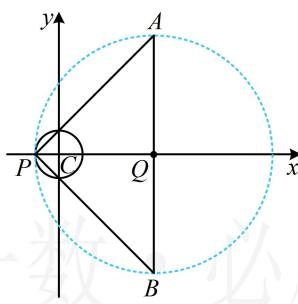
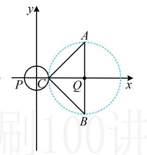

> [!faq]- 《第6节 隐圆问题》参考答案
>
> > [!success]- **【答案】** B
>
> > [!note]- **【分析】**
> > 本题未单列分析。
>
> > [!note]- **【解析】**
> > （2024·山东济南二模·★★☆）
> >
> > 已知圆 $C: x^{2} + y^{2} = 1$ ， $A(4, a)$ ， $B(4, -a)$ ，若圆 C 上有且仅有一点 P 使 $PA \perp PB$ ，则正实数 a 的取值为（）
> >
> > A. 2 或 4
> >
> > B. 2 或 3
> >
> > C. 4 或 5
> >
> > D. 3 或 5
> >
> > 解析： $PA \perp PB$ 意味着点 P 在以 AB 为直径的圆上，所以题设条件等价于圆 C 上有且仅有一点在以 AB 为直径的圆上，这可按两圆的位置关系问题处理，且有外切和内切两种情况，下面分别考虑，
> > 由题意，AB 的中点为 $Q(4,0)$ ， $|QA|=a$ ， $PA \perp PB \Rightarrow$ 点 P 在以点 Q 为圆心，a 为半径的圆上，
> > 如图1，若圆Q与圆C内切，则 $|QC|=a-1$ ①，
> > 又圆C的圆心为 $C(0,0)$ ，所以 $|QC|=4$ ，
> > 代入①得4=a-1，故a=5；
> > 如图2，若圆Q与圆C外切，则 $|QC|=a+1$ ，
> > 即 $4 = a + 1$ ，故 a = 3；
> > 综上所述，正实数 a 的取值为3或5.
> >
> >   
> > 图1
> >
> >   
> > 图2
