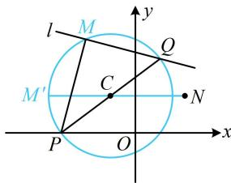

> [!faq]- 《第6节 隐圆问题》参考答案
>
> > [!success]- **【答案】** D
>
> > [!note]- **【分析】**
> > 本题未单列分析。
>
> > [!note]- **【解析】**
> > 解析：直线 l 含参，先看它是否过定点， $mx + ny - (m + 3n) = 0 \Rightarrow m(x - 1) + n(y - 3) = 0$ 令 $\left\{\begin{aligned}x-1&=0\\ y-3&=0\end{aligned}\right.$ 可得： $\left\{\begin{aligned}x&=1\\ y&=3\end{aligned}\right.$ ，所以直线l过定点 $Q(1,3)$ ，
> > 直线l绕定点Q旋转，可画图看看，如图， $PM\perp MQ$ ，
> > 所以M在以PQ为直径的圆上，该圆的圆心为 $C\left(-1,\frac{3}{2}\right)$ ，
> > 半径 $r=\frac{1}{2}|PQ|=\frac{1}{2}\sqrt{(-3-1)^{2}+(0-3)^{2}}=\frac{5}{2}$
> >
> > 接下来就是圆上动点 $M$ 与定点 $N$ 的距离的最值问题了，图中 $M'$ 处即为该距离最大的情形，因为 $\left|CN\right| = \sqrt{(-1 - 2)^2 + \left(\frac{3}{2} - \frac{3}{2}\right)^2} = 3$ ，所以 $\left|M N\right|_{\max} = \left|M' N\right| = \left|M'C\right| + \left| C N\right| = \frac{5}{2} + 3 = \frac{11}{2}$ .
> >
> > 
