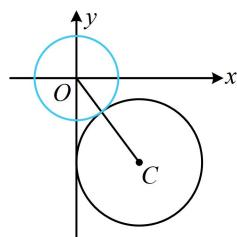
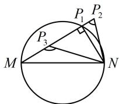

> [!faq]- 《第6节 隐圆问题》参考答案
>
> > [!success]- **【答案】** $(2, + \infty)$
>
> > [!note]- **【分析】**
> > 本题未单列分析。
>
> > [!note]- **【解析】**
> > 解析：钝角这种条件怎么翻译？我们知道直角可翻译成“圆上”，那钝角呢？翻译成“圆内”即可，
> >
> > 若 $\angle MPN$ 为钝角，则点 $P$ 在以 $MN$ 为直径的圆内，该圆的圆心为原点 $O$ ，半径 $r_1 = a$ ，这样问题就可表述为圆 $C$ 上存在点 $P$ 在上述圆 $O$ 内部，先画图看看，
> >
> > 临界状态如图，两圆外切，因为圆 $C$ 的圆心为 $C(3, - 4)$
> >
> > 半径 $r_2 = 3$ ，所以 $\left|OC\right| = \sqrt{3^2 + (-4)^2} = 5$
> >
> > 当两圆外切时， $\left|OC\right|=r_{1}+r_{2}$ ，即 $5=a+3$ ，解得：a=2，
> >
> > 由图可知，当 $a > 2$ 时，圆 $C$ 上有点在圆 $O$ 内部，
> >
> > 故 a 的取值范围是 $(2, +\infty)$ .
> >
> > 
>
> > [!tip]- **【反思】**
> > 对于以 $MN$ 为直径的圆，如图，若 $\angle MP_1N$ 为直角，则点 $P_{1}$ 在该圆上；若 $\angle MP_2N$ 为锐角，则点 $P_{2}$ 在该圆外；若 $\angle MP_3N$ 为钝角，则点 $P_{3}$ 在该圆内.
> >
> > 
> >
> > 一数·必刷100讲
