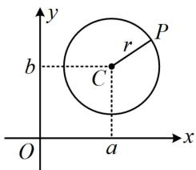
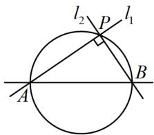
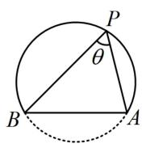
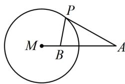

<!-- source-part:1 pages:1-4 -->

# 第6节 隐圆问题（★★★）

## 内容提要

本节归纳高考中几类常见的隐圆问题：

1. 定长对定点：平面上到定点 $C(a, b)$ 的距离等于定长 $r$ 的点 $P$ 的轨迹是圆，如图1.

2. 定长对定角:

①平面上过两定点 $A$ 和 $B$ 的直线 $l_{1}$ 、 $l_{2}$ 互相垂直，则它们交点 $P$ 的轨迹为圆，如图2.

② 平面上与两定点 $A$ 和 $B$ 所成视角为固定锐角或钝角的点的轨迹为一段圆弧，如图3.

3. 定长对定比（阿氏圆）：设 $A$ 和 $B$ 是平面内两定点，若点 $P$ 满足 $\frac{|PA|}{|PB|} = \lambda (\lambda > 0$ 且 $\lambda \neq 1)$ ，则点 $P$ 的轨迹是圆，该圆被称为阿氏圆，如图4.

  
图1

  
图2

  
图3

  
图4

![[高中/总复习/教辅/一数常规版2026/第10章 解析几何/模块2 圆与方程/第6节 隐圆问题/类型01_定长对定点_一数_必刷100讲/类型01_定长对定点_一数_必刷100讲.md]]
![[高中/总复习/教辅/一数常规版2026/第10章 解析几何/模块2 圆与方程/第6节 隐圆问题/类型02_定长对定角/类型02_定长对定角.md]]
![[高中/总复习/教辅/一数常规版2026/第10章 解析几何/模块2 圆与方程/第6节 隐圆问题/类型03_定长对定比_阿氏圆_/类型03_定长对定比_阿氏圆_.md]]
![[高中/总复习/教辅/一数常规版2026/第10章 解析几何/模块2 圆与方程/第6节 隐圆问题/强化训练/强化训练.md]]
