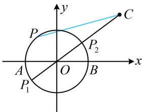

> [!faq]- 《第6节 隐圆问题》例题解析
>
> > [!success]- **【答案】** C
>
> > [!note]- **【分析】**
> > 本题未单列分析。
>
> > [!note]- **【解析】**
> > 解析：$A$ ， $B$ 是定点，由 $PA \perp PB$ 可知点 $P$ 的轨迹是以 $AB$ 为直径的圆，先求出该圆，
> >
> > 由题意，点 $P$ 在圆 $x^{2} + y^{2} = 4$ 上（不含 $A, B$ 两点），
> >
> > 如图，点 $C$ 在圆外， $|PC|$ 的最大、最小值分别在 $P_{1}$ ， $P_{2}$ 处取得，
> >
> > 因为 $|OC| = \sqrt{4^2 + 3^2} = 5$ ，所以 $\left|PC\right|_{\max} = \left|OC\right| + \left|OP_1\right| = 7$ ， $\left|PC\right|_{\min} = \left|OC\right| - \left|OP_2\right| = 3$ .
> >
> >
> > 
