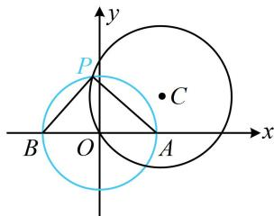

> [!faq]- 《第6节 隐圆问题》例题解析
>
> > [!success]- **【答案】** B
>
> > [!note]- **【分析】**
> > 本题未单列分析。
>
> > [!note]- **【解析】**
> > 解析：$\angle APB = 90^{\circ}$ 隐含了点 $P$ 的轨迹是圆，先把该圆找到，
> >
> > 因为 $\angle APB = 90^{\circ}$ , 所以点 $P$ 在以 $AB$ 为直径的圆上, 该圆的圆心为原点 $O$ , 半径 $r_1 = a$ ,
> >
> > 点 $P$ 也在圆 $C$ 上, 于是两圆应有交点, 如图, 可根据圆与圆的位置关系来求 $a$ 的范围,
> >
> > 由题意，圆 $C$ 的圆心为 $C(\sqrt{3},1)$ ，半径 $r_2 = 2$ ，所以 $\vert OC\vert = 2$
> >
> > 两圆有交点 $\Rightarrow |r_1 - r_2| \leq |OC| \leq r_1 + r_2$ ，所以 $|a - 2| \leq 2 \leq a + 2$ ，
> >
> > 结合 $a > 0$ 解得： $0 < a \leq 4$
> >
> >
> > 
