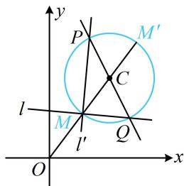

> [!faq]- 《第6节 隐圆问题》例题解析
>
> > [!success]- **【答案】** B
>
> > [!note]- **【分析】**
> > 本题未单列分析。
>
> > [!note]- **【解析】**
> > 解析：直线 $l$ 含参，先看看它是否过定点， $2mx - (4m + n)y + 2n = 0 \Rightarrow m(2x - 4y) + n(2 - y) = 0$
> >
> > 令 $\left\{ \begin{array}{l} 2x - 4y = 0 \\ 2 - y = 0 \end{array} \right.$ 可得： $\left\{ \begin{array}{l} x = 4 \\ y = 2 \end{array} \right.$ ，所以直线 $l$ 过定点 $Q(4,2)$ ，
> >
> > 如图， $l \perp l'$ ，垂足为 M，所以点 M 的轨迹是以 PQ 为直径的圆，圆心为 $C(3,4)$ ，半径 $r = \frac{1}{2} |PQ| = \sqrt{5}$ ，
> >
> > 接下来就是圆外定点与圆上动点距离的范围问题了， $|OM|$ 最小的情形如图，最大时 $M$ 为图中的 $M^{\prime}$ ，
> >
> > 因为 $|OC| = \sqrt{3^2 + 4^2} = 5$ ，所以图中 $|OM| = |OC| - r = 5 - \sqrt{5}$ ，
> >
> > 
> >
> > $\left|OM'\right| = \left|OC\right| + r = 5 + \sqrt{5}$ ，故 $\left|OM\right|$ 的取值范围是 $[5 - \sqrt{5}, 5 + \sqrt{5}]$ .
>
> > [!tip]- **【反思】**
> > 从例 3 和两个变式可以看出，涉及过两定点的两动直线互相垂直时，它们的交点的轨迹是圆.
