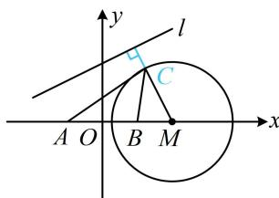

> [!faq]- 《第6节 隐圆问题》例题解析
>
> > [!success]- **【答案】** $\sqrt{5} - \sqrt{3}$
>
> > [!note]- **【分析】**
> > 本题未单列分析。
>
> > [!note]- **【解析】**
> > 解析：要求目标，需找 $C$ 的轨迹，可设 $C$ 的坐标，利用两点距离公式翻译距离之比的条件，
> >
> > 设 $C(x,y)$ ，则由 $\frac{|CA|}{|CB|} = \sqrt{3}$ 可得 $\frac{\sqrt{(x + 1)^2 + y^2}}{\sqrt{(x - 1)^2 + y^2}} = \sqrt{3}$ ，整理得： $(x - 2)^2 +y^2 = 3$
> >
> > 所以点 $C$ 在圆心为 $M(2,0)$ ，半径 $r = \sqrt{3}$ 的圆上，圆心 $M$ 到直线 $l$ 的距离 $d = \frac{|2 + 3|}{\sqrt{1^2 + (-2)^2}} = \sqrt{5} > \sqrt{3}$ ，
> >
> > 直线 $l$ 与圆 $M$ 相离，图中的点 $C$ 即为到 $l$ 距离最小的情形，
> >
> > 由图可知，所求距离的最小值为 $d - r = \sqrt{5} -\sqrt{3}$
> >
> > 
