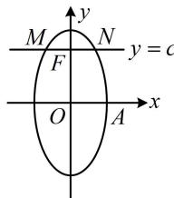

> [!faq]- 《第1节 椭圆的定义、标准方程及简单几何性质》参考答案
>
> > [!success]- **【答案】** 详见解析
>
> > [!note]- **【分析】**
> > 本题未单列分析。
>
> > [!note]- **【解析】**
> > 解析：椭圆的焦点在 $y$ 轴上，其右顶点为 $A(1,0) \Rightarrow b = 1$
> >
> > 椭圆的过焦点且垂直于长轴的弦是通径，可联立通径所在直线和椭圆的方程来求通径长，
> >
> > 如图，设 $F(0,c)$ 是椭圆的上焦点，联立 $\left\{ \begin{array}{l} y = c \\ \frac{y^2}{a^2} + \frac{x^2}{b^2} = 1 \end{array} \right.$ 消去 $y$ 可得 $x^2 = b^2 \left(1 - \frac{c^2}{a^2}\right) = b^2 \cdot \frac{a^2 - c^2}{a^2} = \frac{b^4}{a^2}$ ，
> >
> > 所以 $x = \pm \frac{b^2}{a}$ ，故通径长 $\left|MN\right| = \frac{2b^2}{a}$ ，由题意， $\frac{2b^2}{a} = 1$
> >
> > 所以 $a = 2b^{2} = 2$ ，故椭圆的方程为 $\frac{y^2}{4} + x^2 = 1$
> >
> > 
